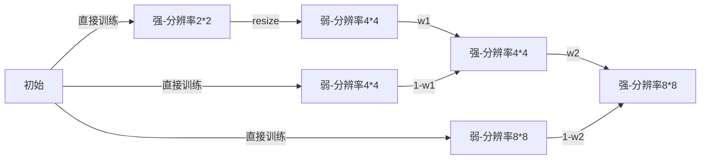

# Pi-GAN

## Knowledge

**1. mapping network**

**2. FiLM SIREN**

### SIREN

$$
\Phi(\mathbf{x})=\mathbf{W}_{n}\left(\phi_{n-1} \circ \phi_{n-2} \circ \ldots \circ \phi_{0}\right)(\mathbf{x})+\mathbf{b}_{n}, \quad \mathbf{x}_{i} \mapsto \phi_{i}\left(\mathbf{x}_{i}\right)=\sin \left(\mathbf{W}_{i} \mathbf{x}_{i}+\mathbf{b}_{i}\right)
$$

> 参数如何设？

- initialize the first layer of the sine network

  $\sin \left(\omega_{0} \cdot \mathbf{W} \mathbf{x}+\mathbf{b}\right)$  where $\omega_0 = 30$

- other layer of the sine network

  $w_{i} \sim \mathcal{U}(-\sqrt{6 / n}, \sqrt{6 / n})$ where $n$ is the input feature number

> input $x \sim \mathcal{U}(-1, 1)$, output $y = \sin(ax + b)$, assum $a = \frac{\pi}{2}$ 
>
> ? thinking about the distribution of $y$ 
>
> ! $y \sim \arcsin (-1, 1)$

### StyleGAN

**关键点**

- mapping network $z \rightarrow_{FC} w$

> 为了解耦，解耦的效果希望是线性的。因为z采样时服从高斯分布的，但特征不一定是这样的，所以 $w$ 就不服从高斯分布了，而是更符合数据特征分布。

### PGGAN

**关键点：分辨率逐渐加大**

### FiLM

Feature-wise Linear Modulation

## Training detail

