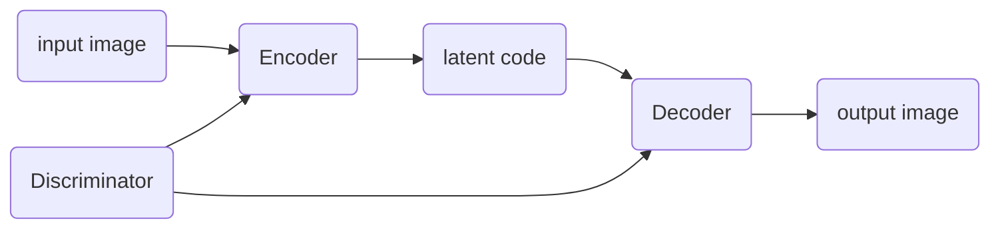

# Generate multi-view from a single-view input

understand 3D shape from 2D projections

require a differentiable 3D-to-2D projection module.

**impact**

> broad applications in vision, graphics, and robotics

**related work**

> model-driven synthesis: 
>
> data-driven generation: [^Zhu et al., 2014]
>
> combination of the both [^Peng et al., 2017]
>
> GAN: [^Tran et al., 2017] [^Zhao et al., 2017]

Encoder-decoder 

**GAN pipeline in this problem**

disentangle pose and identity factors by cross-reconstruction [^Peng et al., 2017][^Zhu et al., 2014]

[^Peng et al., 2017]:Reconstruction-based disentanglement for pose-invariant face recognition
[^Zhu et al., 2014]:Multi-view perceptron: a deep model for learning face identity and view representations
[^Tran et al., 2017]:Disentangled Representation Learning GAN for Pose-Invariant Face Recognition
[^Zhao et al., 2017]: Multi-view image generation from a single-view

